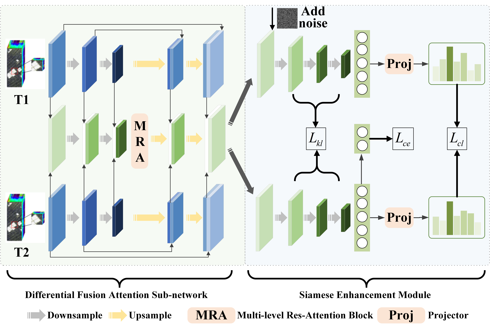

# DCENet (Diff-Feature Contrast Enhancement Network)

Pytorch implementation for [DCENet](https://ieeexplore.ieee.org/document/10462227) 《DCENet: Diff-Feature Contrast Enhancement Network for Semi-supervised Hyperspectral Change Detection》
```c 
F. Luo, T. Zhou, J. Liu, T. Guo, X. Gong and X. Gao, "DCENet: Diff-Feature Contrast Enhancement Network for Semi-supervised Hyperspectral Change Detection," in IEEE Transactions on Geoscience and Remote Sensing, doi: 10.1109/TGRS.2024.3374600. 
```
### Introduction
This repository includes DCENet implementations in PyTorch version and partial datasets in the paper.




### Requirements
Python 3.9  <br />
PyTorch 1.10.2  <br />

### Citation
Please cite our paper if you use this code in your research.
```c  
F. Luo, T. Zhou, J. Liu, T. Guo, X. Gong and X. Gao, "DCENet: Diff-Feature Contrast Enhancement Network for Semi-Supervised Hyperspectral Change Detection," in IEEE Transactions on Geoscience and Remote Sensing, vol. 62, pp. 1-14, 2024, Art no. 5511514, doi: 10.1109/TGRS.2024.3374600.
```
```c
@ARTICLE{10462227,
  author={Luo, Fulin and Zhou, Tianyuan and Liu, Jiamin and Guo, Tan and Gong, Xiuwen and Gao, Xinbo},
  journal={IEEE Transactions on Geoscience and Remote Sensing}, 
  title={DCENet: Diff-Feature Contrast Enhancement Network for Semi-Supervised Hyperspectral Change Detection}, 
  year={2024},
  volume={62},
  number={},
  pages={1-14},
  keywords={Feature extraction;Training;Data mining;Probabilistic logic;Hyperspectral imaging;Decoding;Data models;Change detection (CD);contrastive learning;hyperspectral image;multiscale feature;Siamese network},
  doi={10.1109/TGRS.2024.3374600}}
```

### License
Code and datasets are released for non-commercial and research purposes only. For commercial purposes, please contact the authors.
